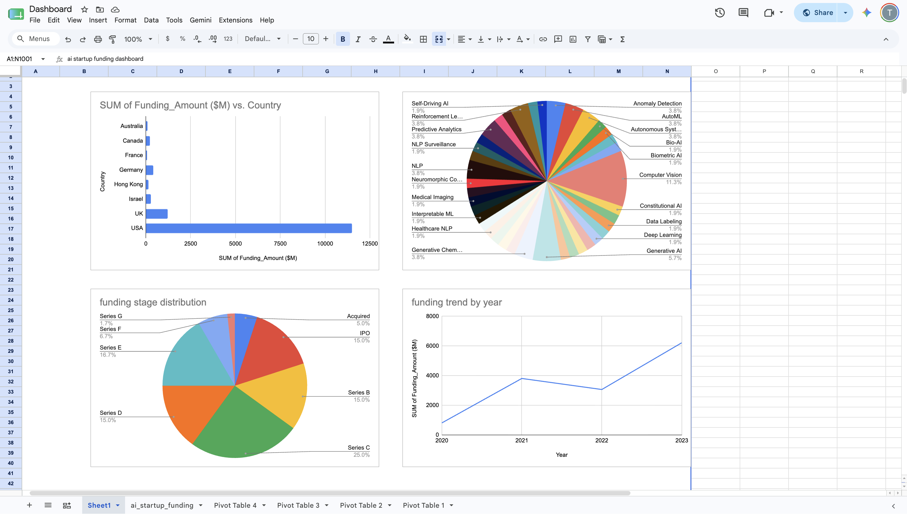

# AI Startup Research Dashboard

## Tools Used
- Microsoft Excel
- Pivot Tables
- Pivot Charts
- Data Visualization

## Dashboard Preview

## Key Insights
- USA attracted the highest startup funding.
- Computer Vision startups had the highest representation.
- Series C was the most common funding stage.
- Startup funding increased significantly by 2023.
